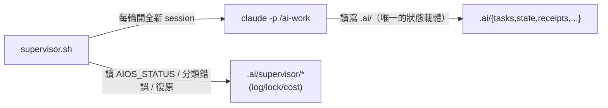

# AI-RUNTIME.md — AI Engineer OS 協定權威文件

> 這份文件定義 `.ai/` runtime workspace 的所有 schema 與協定。
> 任何 skill、supervisor、或人類對格式有疑問時，**以這份為準**。
> 對應的操作入口：`/ai-init`（安裝）、`/ai-work`（執行一輪）、`/ai-report`（產報告）、
> `supervisor/supervisor.sh`（無人監督迴圈）。

## 系統圖



核心原則：**所有狀態都在檔案裡**。agent session 是無狀態的、可拋棄的；
crash / rate-limit / 手動中斷之後的恢復，跟正常啟動是同一條路徑。

**單一寫入者不變量**：同一個 repo 的 `.ai/` 狀態任何時刻只該有一個寫入
者。兩層鎖各管各的生命週期，都存 pid、都靠 `kill -0` 判斷存活：

- `.ai/supervisor/lock`：`supervisor.sh` 啟動時取得，**整個無人迴圈**
  （可能橫跨很多輪 `/ai-work`）期間持有，退出時清掉。只擋第二個
  `supervisor.sh` 開起來——它不知道、也不管底下單一一輪 `/ai-work` 或
  `/ai-review` 個別跑了多久。
- `.ai/state/session.lock`：`/ai-work`／`/ai-review` **每次被呼叫**（不論
  呼叫者是 `supervisor.sh`、還是人類自己 `claude -p` 或互動執行）都會在
  真正開始讀寫狀態前取得、印出最終 `AIOS_STATUS`/`AIOS_REVIEW` 行前釋放
  （用 Write 工具清空內容，不是 `rm`——`rm` 被 deny）。這層抓的是「現在
  這一刻到底有沒有人正在跑一輪」，粒度是單次呼叫，不是整個迴圈；
  `supervisor.sh` 呼叫 `/ai-work` 時是循序等待每輪結束才呼叫下一輪，
  不會自己跟自己撞，所以 `/ai-work`／`/ai-review` 只需要檢查
  `session.lock`、不需要檢查 `supervisor/lock`。

`/ai-task`、`/ai-wrap` 這類**人類互動 skill 在動筆前要把兩層鎖都讀一次**
（任一個 pid 存活都代表有人在整檔重寫 `tasks/*.yaml`／
`state/checkpoint.json`），用 AskUserQuestion 讓人類知道有覆寫風險並選擇
是否仍要繼續，而不是靜靜地跟另一個 session 同時寫壞同一份檔案。
`/ai-work`／`/ai-review` 撞到 `session.lock` 存活則不彈互動問題——兩者都
可能被 `supervisor.sh` 用 `claude -p` headless 呼叫，沒有人類在場回答，
一律什麼都不寫、直接印各自既有協定裡代表「這輪沒有產出」的狀態行結束
（`/ai-work` 印 `AIOS_STATUS: BLOCKED`；`/ai-review` 沒有對應的失敗態，
借用「沒東西可審」的 `AIOS_REVIEW: PASS task=none followup=none`，前面
加一行說明是撞鎖跳過、不是真的審查通過）。

**`session.lock` 的存活判斷不能只看 `kill -0`**：單次呼叫被 watchdog
砍掉（或任何非正常結束）時來不及清空 lock，殘留的 pid 之後可能被作業系統
回收給完全無關的行程——`kill -0` 對這種「巧合存活」的 pid 一樣回傳成功，
會把孤兒 lock 誤判成「還在跑」，卡死到有人手動清掉為止（實測發生過：
lock 是數小時前某輪被砍掉的呼叫留下的，pid 恰好被一個六天前就啟動、
毫不相干的背景行程佔用）。因此判斷存活要**同時滿足兩個條件**：
`kill -0 <pid>` 成功，**且** lock 檔案的 mtime 在 2 小時內——超過 2 小時
一律視為過期，不管 pid 是否「活著」（單次 `/ai-work`／`/ai-review` 呼叫
正常不會跑這麼久，headless 情況下更受 watchdog 30 分鐘 timeout 保護）。
過期的 lock 沿用「殘留 lock」的既有處理方式：直接視為未持有，不特別
清空／不特別報錯。**這條門檻只套用在 `session.lock`**，`supervisor/lock`
的存活週期橫跨整個無人迴圈，本來就可能合法地存活數小時以上，不能套
同一個門檻。

## `.ai/` 目錄結構

```
.ai/
├── CONTRACT.md          agent 的長期規則（/ai-init 訪談後填成）
├── schedule.yml         supervisor 參數與啟動時刻（扁平 key；
│                        schedule_start_times 由 schedule-install.sh 讀）
├── tasks/
│   ├── backlog.yaml     待辦佇列
│   ├── doing.yaml       進行中（不變量：至多 1 筆）
│   └── done.yaml        已完成（append-only）
├── state/
│   ├── checkpoint.json  斷點（每個子步驟後重寫）
│   ├── context.md       滾動工作情境（≤100 行）
│   ├── memory.md        長期教訓（可重用的知識才進來）
│   ├── decisions.md     架構決策紀錄（ADR-lite）
│   └── session.lock     單次 /ai-work、/ai-review 呼叫期間持有（存 pid，
│                        釋放時清空內容不留 pid；跟 supervisor/lock 是
│                        兩層鎖，見上面單一寫入者不變量說明）
├── rubrics/             自評量表（依 task type 選用）
├── agents/              /ai-work 各步驟採用的 persona 定義
├── receipts/YYYY-MM-DD/NNN.md   每個任務的審計收據
├── reports/             /ai-report 產出
├── supervisor/          supervisor 執行狀態（gitignored；含 events.jsonl loop 事件）
├── STOP                 （存在即要求全面停止；人類手動建立/刪除）
├── PAUSED               （存在即等待人類；內容 = agent 的具體問題）
├── PAUSED.consumed      （/ai-work 消化回覆後把 PAUSED 搬到這裡留痕；
│                          固定檔名，每次都覆蓋，不累積）
└── REVIEW_REQUESTED     （agent 對大型變更（>10 檔）立的旗；supervisor
                           見旗即在本輪後強制跑獨立審查並清旗——
                           即使 review_after_task 關閉也會跑）
```

## AIOS_STATUS 協定

`/ai-work` 每次執行的**最後一行輸出**必須是：

```
AIOS_STATUS: <STATUS> task=<id|none> score=<0-100|na> receipt=<相對路徑|none>
```

實例：`AIOS_STATUS: DONE_TASK task=T-001 score=100 receipt=receipts/2026-07-08/001.md`
（receipt 欄 = 相對 `.ai/` 的完整路徑；receipt frontmatter 內的自我編號
則是短形 `"2026-07-08/001"`。）

| STATUS | 意義 | supervisor 的動作 |
|---|---|---|
| `DONE_TASK` | 完成一個任務 | 繼續下一輪 |
| `TASK_PARTIAL` | 任務部分完成/測試修不動已退回 | 繼續下一輪 |
| `QUEUE_EMPTY` | 佇列沒有可執行任務 | 正常結束（exit 0） |
| `BLOCKED` | 無法進行：權限/環境阻擋（含「完全無法寫入」的免寫出口），或撞到 `.ai/state/session.lock`（另一個 /ai-work／/ai-review 正在跑）——兩種情況都是什麼檔案都不碰，只印狀態行 | 繼續下一輪 |
| `PAUSED` | 需要人類（.ai/PAUSED 已寫入問題） | 印出問題後停止（exit 2）；`--wait-on-pause`／schedule.yml `wait_on_pause: true` 則不退出，改每 `pause_poll_interval_seconds` 秒（預設 30）輪詢直到偵測到回覆 |

**PAUSED 的回覆協定**：任何介面（/ai-answer、panel 網頁、直接編輯檔案）
把回答**附加**成 `## 人類回覆（時間）` 節即可；下一輪 /ai-work 步驟 0 讀到
回覆節會統一路由（任務描述/abandoned/memory.md）並清旗繼續。PAUSED 是
協定中唯一允許清掉的信號旗——內容在清掉前已落地他處。**清法是
`mv .ai/PAUSED .ai/PAUSED.consumed`，不是 `rm`**：目標 repo 的
`settings.local.json` 對 `Bash(rm:*)` 是硬 deny（Claude Code 的權限
規則 deny 永遠贏 allow，不管誰更具體，所以無法在 rm 的 deny 裡開
allow 例外），`mv` 不在 deny 名單裡，改用它可以繞開這個死結，且不用
放寬 rm 的封鎖範圍。gate 判斷只看 `.ai/PAUSED` 這個路徑存不存在，
mv 之後路徑一樣不存在，效果等價。
| `STOPPED` | .ai/STOP 存在 | 立即結束（exit 0） |
| `CONTRACT_HALT` | 任務要求被契約禁止的操作 | 繼續下一輪（換任務） |

## AIOS_REVIEW 協定（多 agent 審查輪，可選）

`schedule.yml` 的 `review_after_task: true`（或 supervisor `--review`）時，
每個 `DONE_TASK` 之後 supervisor 會開一個**全新 session** 跑 `/ai-review`：
獨立重評上一個任務（fresh context，非實作者自評）。除了
`review_after_task: true` 的常規觸發，**大型變更（單任務 >10 檔）為
強制觸發**：agent 收尾時建立 `.ai/REVIEW_REQUESTED` 旗標，supervisor
讀到旗標就跑審查輪並清旗，不受 review_after_task 設定影響——大變更
不暫停等人（會把佇列卡死），但必須有第二雙眼睛。輸出最後一行：

```
AIOS_REVIEW: <PASS|FAIL> task=<id> followup=<新任務id|none>
```

FAIL 時 reviewer **不自己修**——把修正任務（priority 1）排進 backlog，
下一輪 /ai-work 自然接手；審查判定同時附加在受審 receipt 尾端。
這維持了單一寫手不變量：任何時刻只有一個 session 在改程式碼。

**修正引用/事實類的 followup 任務，acceptance 必須附明確依據來源**：
若這個 followup 任務是要修正上一版對某個事實、數字、或引用內容的認定
（而非新增功能或修一般 bug 邏輯），acceptance 至少要有一條要求「改動處
附一句明確引用依據，指出根據哪個既有檔案/欄位的內容判定」——reviewer
自己這一輪的判斷不算依據，必須回溯到最原始的事實來源（例如另一份任務
定義、schema、或原始需求文件）。原因：fresh session 審查彼此不共享
context，若某一輪 review 看漏了原始依據就下判定，下一輪執行者若照單
全收、不回頭核對，會把本來正確的內容改壞；沒有依據引用時，這種錯誤要
再等一輪 review 才會被抓到，多耗一輪的成本。

## checkpoint.json schema

```json
{
  "version": 1,
  "updated_at": "2026-07-08T10:00:00+08:00",
  "iteration": 0,
  "phase": "idle",
  "current_task_id": null,
  "task_step": null,
  "last_completed_task_id": null,
  "last_receipt": null,
  "last_commit": null,
  "eval": { "attempts": 0, "last_score": null },
  "blocked_reason": null,
  "session_notes": null
}
```

- `phase` ∈ `idle | selecting | executing | testing | evaluating | committing`
- `task_step`：自由文字，精確描述「目前做到哪個子步驟」——中途被殺時，
  下一個 session 從這裡續作，不重頭
- `session_notes`：≤3 行，下一個 session 必須知道的事
- **規則：整檔重寫，不做局部修補**。JSON 壞掉時：從本 schema 重置、
  在 memory.md 記一筆、繼續工作（自癒優先於追究）
- **時間戳一律用 `date` 指令取實際系統時間**
  （`date +"%Y-%m-%dT%H:%M:%S%z"`；時區 `+0800` 或 `+08:00` 皆合法），
  **不得自行推算**——agent 對「現在幾點」沒有可靠感知，猜的時間戳會
  污染 panel 顯示、報表排序與稽核軌跡。此規則適用於協定內**所有**
  時間欄位：`updated_at`、`created_at`、`started_at`、`finished_at`、
  receipt frontmatter、`## 人類回覆（時間）` 節標題

## tasks/*.yaml schema

```yaml
# backlog.yaml
version: 1
tasks:
  - id: T-001              # T-NNN，遞增不重用
    title: ""
    priority: 1            # 1 = 最高
    type: feature          # feature|fix|chore|test|docs|architecture|performance
    description: ""
    acceptance:            # 可客觀驗證的完成條件，至少一條
      - ""
    depends_on: []         # 這些 id 必須已在 done.yaml
    status: pending        # pending | blocked
    blocked_reason: null
    attempts: 0
    max_attempts: 3
    created_at: "2026-07-08T10:00:00+08:00"
```

- `doing.yaml`：同結構 + `started_at`。**不變量：至多 1 筆**（單 agent）。
  發現多於 1 筆＝前一輪異常中斷：把多餘的退回 backlog 再繼續。
- `done.yaml`：同結構 + `finished_at`、`result`（done|partial|abandoned）、
  `receipt`（收據相對路徑）、選填 `source`（省略 = `agent`；
  `human-interactive` = 人類互動 session 的產出，見下節）。
  **append-only，永不改寫既有條目**。
  `abandoned` = 任務達 max_attempts 仍失敗、或被契約終結——移進來
  而不是留在 backlog 當殭屍，/ai-report 的「待人類處理」節會列出它們。
- YAML 一律**整檔重寫**（同 checkpoint 規則）。
- **壞檔自癒（同 checkpoint 規則）**：非法 YAML 或缺 `tasks:` key →
  先搶救可辨識的任務條目再整檔重寫；救不回 → 從模板重置為空佇列並在
  memory.md 記一筆。**例外：`done.yaml` 是 append-only 稽核檔**——
  救不回時先改名 `done.yaml.corrupt-<日期>` 保留原檔再開新檔，
  絕不靜默清空。supervisor 每次啟動會對四個狀態檔做結構 lint
  （只偵測、寫進 run.log；修復永遠歸 /ai-work 的自癒協定）。

## 人類互動 session（source: human-interactive）

不是所有工作都走 `/ai-work` 自動迴圈——人類貼截圖、即時反饋、Claude 直接
修改的互動協作也是合法的工作來源。規則：**同一條稽核軌道，不同的來源
標記**。互動 session 改了 AIOS 管理的 repo 就必須在收尾時補齊：

1. 程式碼 commit（訊息帶 `[T-NNN]`，任務 id 照常遞增取號）
2. Receipt（frontmatter `source: human-interactive`；`rubric` 可為 null
   ——互動模式沒有預定義 acceptance 可自評，但「做了什麼/證據」照寫）
3. done.yaml 條目（`source: human-interactive`）

目標 repo 裡的 `/ai-wrap` skill 把這三步收成一個指令。互動 session
**不需要** checkpoint/AIOS_STATUS（那是無人迴圈的恢復機制）；也不受
「不能 commit 到主分支」限制——人類在場即人類批准。

## Receipt 格式 — `receipts/YYYY-MM-DD/NNN.md`

NNN = 當日流水號，補零三位（列目錄取最大值 +1）。

```markdown
---
receipt: "2026-07-08/001"
task_id: T-001
title: ""
status: done            # done | partial | blocked | failed | paused
source: agent           # agent | human-interactive（見下方「人類互動 session」）
started_at: ""
finished_at: ""
commit: null            # 程式碼 commit 的 sha；無則 null
files_changed: []
tests: { command: "", result: "pass", summary: "" }   # result: pass|fail|skipped
rubric: { name: null, score: null, threshold: 80, attempts: 0 }
---

## 做了什麼

## 為什麼（決策理由）

## 證據
（測試輸出摘錄 + `git diff --stat`；沒有證據的宣稱不要寫）

## 未盡事項與風險
```

frontmatter 供 `/ai-report` 機器讀取；prose 供人類與履歷管線使用。

## 事件模型（三層，各有機械寫手）

想回答「這個 repo 發生過什麼」時，三層事件各管一段，**沒有統一事件匯流排
——每層的寫手都是最不會說謊的那個**：

| 層 | 事實 | 存放 | 寫手 | 性質 |
|---|---|---|---|---|
| task | 做了什麼、證據、自評 | `receipts/YYYY-MM-DD/NNN.md` | agent（依本協定） | 稽核資產，committed |
| code | 程式碼實際怎麼變 | `ai/queue` 分支的 git log | git | 稽核資產，committed |
| loop | supervisor 為什麼睡/停/殺 | `.ai/supervisor/events.jsonl` | supervisor（純 bash） | 執行遙測，gitignored，**非稽核** |

`events.jsonl` 一行一事件（LLM 不參與寫入——結構化日誌不交給 LLM 寫）：

```json
{"at":"2026-07-15T17:00:00+0800","event":"iteration","iter":3,"class":"productive",
 "status":"DONE_TASK","task":"T-004","cost_usd":0.42,
 "cache_creation_input_tokens":1865,"cache_read_input_tokens":26691,
 "input_tokens":2,"output_tokens":4,"detail":""}
```

- `event`：`run_start | iteration | review | rate_limit_sleep | quota_wait |
  quota_stop | cost_breaker | watchdog_kill | run_end`
- `review`：`review_after_task` 開啟或 `REVIEW_REQUESTED` 旗標觸發的
  `/ai-review` 審查輪，`task` 沿用被審查的那個 `iteration` 事件的
  task id（審查輪本身不產生新任務）——讓「這個任務總共花多少錢」的
  加總含審查成本，不只是原始 `/ai-work` 那輪
- `cache_creation_input_tokens`/`cache_read_input_tokens`/`input_tokens`/
  `output_tokens`：從該輪 `claude -p --output-format json` 回應的 `usage`
  物件原樣摘出（`supervisor.sh` 的 `extract_usage_field()`），只在
  `iteration` 事件上有意義；其餘事件一律 `0`（迴圈頂端重置，不帶上一輪殘值）。
  用途：量測「無狀態設計每輪重讀 CONTRACT/skill/state 檔案」的真實 token
  成本佔比——`cache_read_input_tokens` 高、`cache_creation_input_tokens` 低
  代表重讀內容大多命中快取（≈0.1x 價），不是每輪都全價重付
- 值一律消毒（去引號/反斜線/換行，`detail` 截 200 字元）——**有損 by
  design**，要原文去 `run.log`
- 消費者：`/ai-report` 的運行事件摘要節、`dashboard.sh` 的事件表。
  檔案可隨時 truncate/刪除（非稽核檔）；doctor 超過 1MB 會提醒

## Git 紀律（寫進每份 CONTRACT，此處為協定層規定）

- 工作分支：CONTRACT `環境資訊` 指定（預設 `ai/queue`），不存在則從主分支建立
- **只 `git add` 自己為了這個任務修改的檔案；禁止 `git add -A` / `git add .`**
  （目標 repo 可能有人類未 commit 的工作）
- 程式碼 commit：`type(scope): title [T-NNN]`；`.ai/` 紀錄另開
  `chore(ai): records for T-NNN`
- 禁止 force push、禁止 commit 到主分支

## 最小 agent 契約（AIOS conformance）

任何 coding agent（不限 Claude Code）要接手一份 `.ai/` workspace，必須
做到以下六件事。這既是 agent-agnostic 的規格，也是 ROADMAP V1（第二
agent 實測）的檢核表：

1. **讀 CONTRACT.md 並遵守核可邊界**：觸發 §7 任一項 → 寫 `.ai/PAUSED`
   （具體問題＋建議選項）並停下，不得自行越權
2. **尊重控制面**：`.ai/STOP` 存在即退出；PAUSED 未有人類回覆不開工；
   永不修改 CONTRACT.md、schedule.yml、`.claude/**`（deny 名單保護的
   人類控制權）
3. **狀態檔整檔重寫**：checkpoint.json 與 tasks/*.yaml 不做局部修補；
   時間戳一律取自 `date` 指令；壞檔依自癒規則處理（done.yaml 救不回
   改名保留，絕不清空）
4. **每輪結尾印 `AIOS_STATUS` 行**（狀態列表見上）——這是 loop 層
   分類與復原的唯一可靠信號
5. **每個任務收尾寫 receipt ＋ done.yaml append**：證據紀律——沒有
   證據支撐的宣稱不得寫進 receipt
6. **git 紀律**：工作在 `ai/queue` 分支、雙 commit 慣例（程式碼與
   記帳分開）、永不 push——對外動作只有人類觸發的 /ai-ship

目前唯一的 Claude Code 耦合是 **skill 載入方式**（`.claude/skills/`）：
其他 agent 需要用自己的機制把 /ai-work 的演算法餵進 session（system
prompt、AGENTS.md 等）。協定本身只認檔案與上述行為，不認特定 runtime。

## 已知限制（誠實條款）

1. **檔案禁令的強制力**：CONTRACT 的禁止事項對 agent 是指令不是沙箱。
   硬防線只有 `.claude/settings.local.json` 的 permission deny 規則
   （由 /ai-init 安裝，擋 `.claude/**` 與 `.ai/CONTRACT.md` 的編輯與
   白名單外的 Bash）。deny 規則的具體行為隨 Claude Code 版本演進，
   高風險 repo 請勿使用 `--yolo`。已知殘餘繞道：`Bash(git checkout:*)`
   在白名單上（branch 工作流需要），理論上可從 git 歷史還原被 deny
   保護的檔案——收緊會弄壞 /ai-work 的分支流程，記錄在案、接受不堵。
   目標 repo 的 deny 清單被手改或漏併時，`supervisor.sh --doctor`
   的 deny-drift 檢查會抓出來。
2. **LLM 寫壞 YAML/JSON 是遲早的事**：緩解有四層——整檔重寫、壞檔
   自癒重置（`done.yaml` 例外：改名保留不清空）、supervisor 檢查
   checkpoint mtime 前進、supervisor 的結構 lint（啟動時全檢並警告；
   有 jq 時 productive 輪寫壞 checkpoint 會計一次失敗）。lint 是結構
   檢查（合法 JSON／必要 key／無 tab／id 格式／doing ≤1），不是完整
   schema validator——語意層的錯（欄位值錯、跨檔 id 重複）靠 receipts
   與 review 輪把關。
3. **rate-limit 偵測依賴 CLI 訊息格式**（已認得的變體：
   `You've hit your usage/session/weekly limit · resets [at] 8pm/6:50am`、
   headless 的 `Claude AI usage limit reached|<unix epoch>`（epoch 形
   最機器可讀，supervisor 會直接睡到 epoch）、API 的 `rate_limit_error`、
   裸 `429`），版本間可能再改變；supervisor 解析失敗時退回固定睡眠，
   所有未知錯誤都收斂到「有界重試」。改分類 regex 前，先把新變體原文
   加進 `supervisor.sh --self-test` 的 fixtures。
4. **headless 寫入權限**——2026-07-16 已在真實終端驗證通過（momentum
   repo，`--doctor --probe` 一次放行）。仍要注意：從巢狀 Claude session
   呼叫 `claude -p` 時，子 session 的檔案寫入會被父層權限系統攔下，
   所以權限驗證一律在**一般終端機**做（doctor 偵測到巢狀會自己警告）。
   每個新 repo 首次無人值守前照樣跑
   `supervisor.sh --doctor --probe --repo X`——doctor 是環境體檢
   （樹完整性、settings drift、skills、狀態檔結構；零額度），probe 實測
   headless 寫入（spawn 一次 claude 要求寫 probe 檔，花少量額度）；
   失敗時輸出會附修法（allow 條目 / 巢狀 session / `--yolo` 判斷）。
