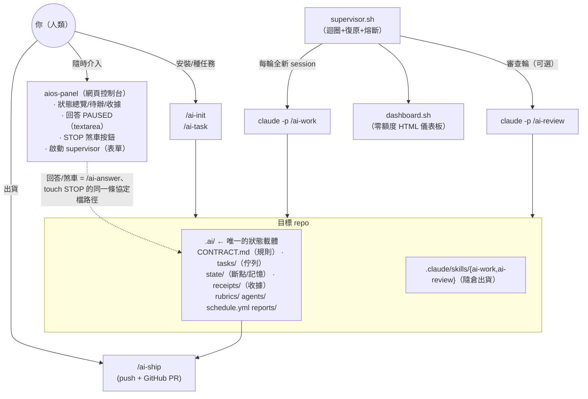
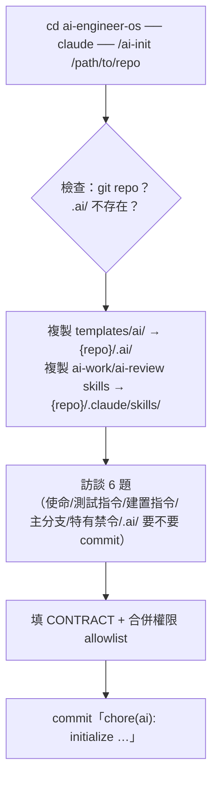
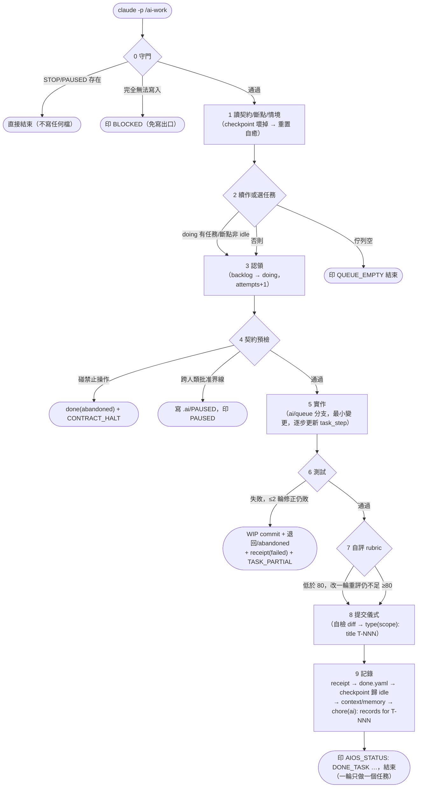
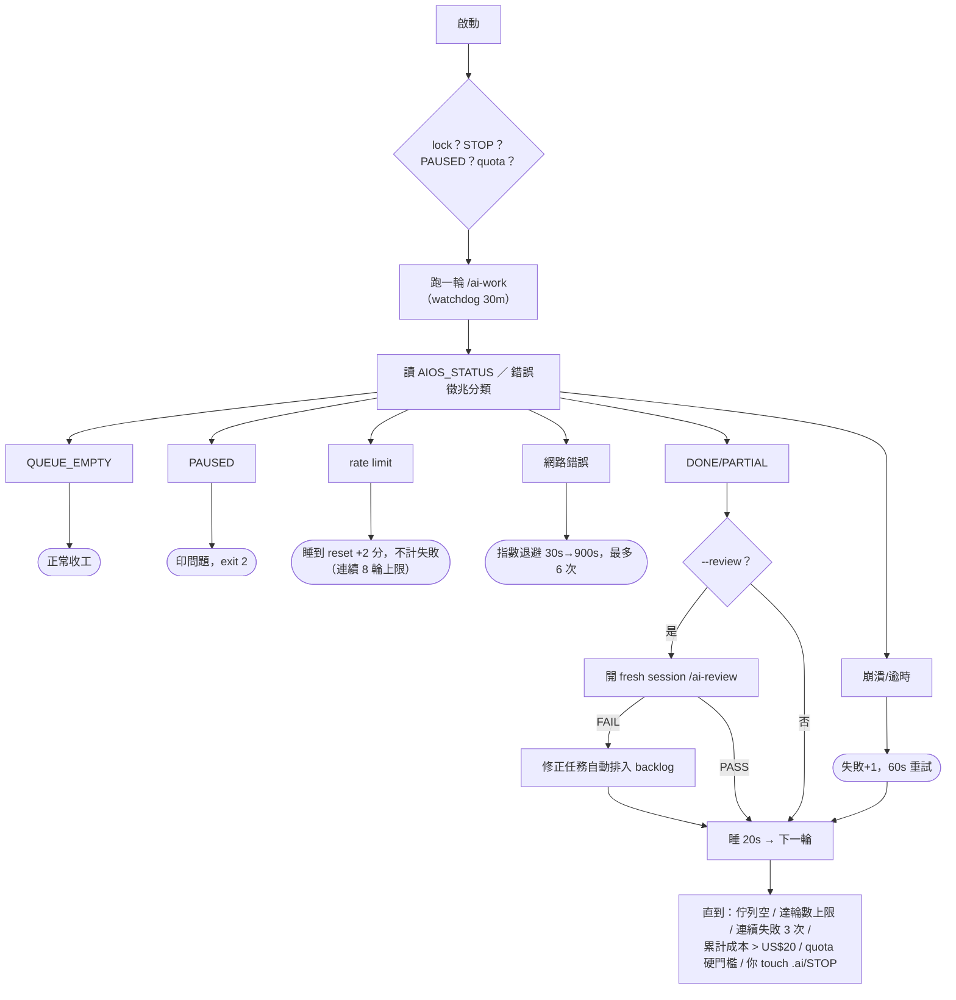
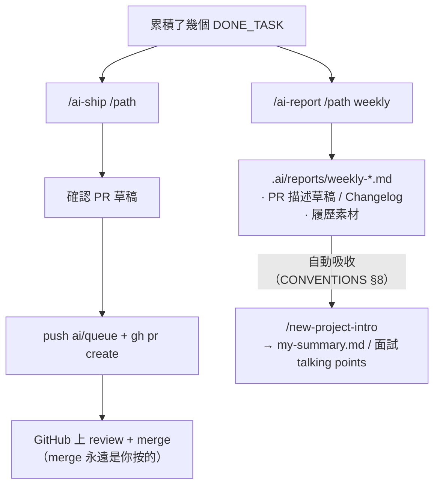

# AI Engineer OS 使用說明書

> 這份是**操作手冊**：怎麼裝、怎麼跑、出事怎麼辦。
> 協定與 schema 的權威定義在 [`AI-RUNTIME.md`](AI-RUNTIME.md)；
> supervisor 細節在 [`supervisor/README.md`](supervisor/README.md)。

## 1. 系統總覽



核心心智模型：**agent session 是無狀態、可拋棄的**；所有狀態都在 `.ai/`
檔案裡。所以 crash、rate limit、你手動關機，恢復方式都一樣——再開一輪就好。

## 2. 首次安裝（每個 repo 一次）



裝完後**先做一件事**：打開 `{repo}/.ai/CONTRACT.md` 讀一遍——這是 agent
的憲法，訪談沒問到的細節（例如「哪些目錄絕不能碰」）現在補進 §4。

## 3. 種任務

**推薦方式（對話引導，不用手寫 YAML）**：

```bash
cd /path/to/repo && claude
/ai-task 幫我把匯出功能的逾時問題修掉
```

它會用選擇題確認 type/priority、**替你起草可驗證的 acceptance 條件**讓你挑、
太大的任務建議拆小，最後預覽 YAML 確認才寫入。

手動方式：編輯 `{repo}/.ai/tasks/backlog.yaml`（schema 見 AI-RUNTIME.md）。
寫好任務的三個判準：

- `acceptance` 每一條都**可客觀驗證**（「跑 `make version` 會輸出短 hash」，
  不是「程式碼品質良好」）
- 一個任務 = 一個 session 做得完的量（做不完的拆小，用 `depends_on` 串）
- `priority: 1` 是最高；同 priority 先進先出

## 4. 執行——一輪長什麼樣（/ai-work）



手動跑一輪（建議首次先這樣觀察）：

```bash
cd /path/to/repo && claude -p "/ai-work"
```

## 5. 無人監督（supervisor）

```bash
supervisor/supervisor.sh --doctor --repo /path/to/repo    # 首跑前體檢（零額度）
supervisor/supervisor.sh --repo /path/to/repo --once      # 先單輪
supervisor/supervisor.sh --repo /path/to/repo             # 正式（預設 ≤10 輪）
supervisor/supervisor.sh --repo /path/to/repo --review    # 每任務加獨立審查
supervisor/schedule-install.sh --repo /path/to/repo       # 固定時刻自動啟動
#   （時刻設在 .ai/schedule.yml 的 schedule_start_times，launchd 排程）
```



**quota 檢查**（每輪跑 `/ai-work` 前，圖中的「lock？STOP？PAUSED？quota？」那步）：
5h 用量 ≥60% 就不開新任務，每 20 分查一次 `/usage` 等降回來自動續跑——
任務不會中途斷頭，5h 就算衝到 100% 也是等，不會停；硬門檻 80% 只看 7d，
達標才寫 STOP 保個人額度（7d 要等數天不划算）。皆可在 `schedule.yml` 調；
想有意衝額度就加 `--ignore-quota`，這次不查也不寫 STOP，連上次 quota 寫的
舊 STOP 都會一併清掉再開跑。

**你隨時可以介入**：
- **停滯復原**：看 `.ai/supervisor/run.log` 找退出原因，然後重跑
  `supervisor.sh --repo {repo}` 就是恢復（checkpoint 續作，殘留 lock 自動清）；
  完整 SOP 見 [supervisor/README.md](supervisor/README.md)
- `touch {repo}/.ai/STOP` → 當輪結束後停（刪掉檔案即恢復）
- agent 留了 `.ai/PAUSED` → 在該 repo 跑 **`/ai-answer`**：它把 agent 的
  問題呈現成選擇題、把你的決定記到正確的地方（任務描述/記憶）、刪掉
  PAUSED、問你要不要立刻重啟（手動流程：讀檔→處理→刪檔，也可以）
- 看狀態：`supervisor/dashboard.sh --repo /path` → 開
  `.ai/reports/dashboard.html`

### 人性化互動的五個入口（都是問答/選擇題/按鈕，不用碰 YAML）

| 情境 | 入口 | 互動形式 |
|---|---|---|
| 首次安裝 | `/ai-init {repo}` | 訪談 6 題填契約 |
| 交辦工作 | `/ai-task {一句話描述}` | 選擇題定 type/priority、挑 acceptance 草稿 |
| agent 卡住等你 | `/ai-answer` 或 **panel 問答區** | 問題＋選項呈現，回覆走同一條協定路徑 |
| 總覽與煞車 | **`aios-panel`**（[panel/README.md](panel/README.md)） | 網頁：多 repo 狀態卡、就地回答、STOP 按鈕、啟動 supervisor |
| 出貨 | `/ai-ship {repo}` | PR 草稿先確認再推送（panel 只提示可出貨數） |

**panel 快速上手**：`cd panel && go run . -repos /path/a,/path/b` →
開 http://127.0.0.1:7777。回覆的協定：任何介面把回答附加成 PAUSED 的
`## 人類回覆` 節，下一輪 /ai-work 自行路由並繼續——panel、/ai-answer、
甚至手機上直接編輯檔案，走的都是同一條路。

## 6. 出貨與收成



## 7. 故障快查

| 症狀 | 先看 | 處置 |
|---|---|---|
| 不確定環境對不對 | `supervisor.sh --doctor --repo X`（零額度，一般終端機跑） | 照各 ❌ 附的修法處理；allow/deny drift 報 missing → 手動補進該 repo 的 settings.local.json |
| supervisor 說 PAUSED | `{repo}/.ai/PAUSED` 內容 | 回答/處理後**刪掉該檔**重啟 |
| 任務一直 failed | 該任務最後一張 receipt 的「證據」節 + `.ai/state/memory.md` | 修 acceptance 或拆小任務；達 max_attempts 會進 done(abandoned) |
| 回報 BLOCKED（權限） | `.ai/supervisor/out.json` 的 denials | 補 `{repo}/.claude/settings.local.json` 白名單；`--doctor --probe` 可直接定位（AI-RUNTIME 已知限制 4） |
| 協定漂移警告 | `{repo}/.claude/skills/ai-work/` 還在嗎 | 重新從 templates 複製 skill |
| 想全部重來 | — | `.ai/` 是普通檔案：git revert 或整包刪掉重新 /ai-init |
| 懷疑 supervisor 本身 | `supervisor.sh --self-test`（零額度） | 全部 fixtures 應過 |

## 8. 成本觀念

每輪 = 一個全新 session（重讀契約與狀態 ~3-5k tokens + 實作 + 測試）。
**實測量級（2026-07-17，kotoba 7 任務）**：一個中型任務 $1.7-4.6、
中位數約 $2-3；整個 backlog（7 任務全一次通過）約 $20。數字是訂閱制下
CLI 的推估值，當相對量看。
安全網依序是：`max_iterations_per_run`（10）→ `max_cost_per_run_usd`
（預設 20 ≈ 5-8 個任務）→ rate-limit 自動睡眠 → 你的 STOP。
想省：任務寫小寫清楚（減少修正輪）、`review_after_task`（預設開，
每任務多 ~$1-2）在不重要的 repo 關掉——但大型變更（>10 檔）的強制
review 不受此設定影響。
